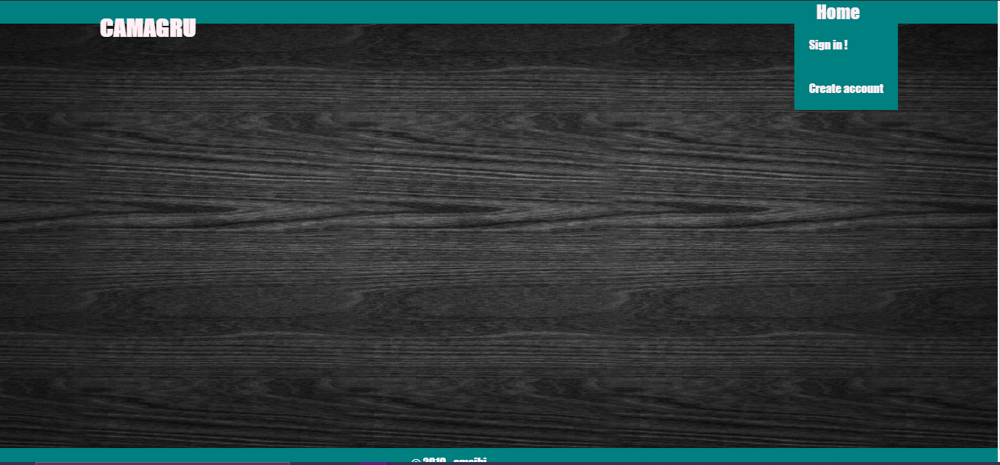

## Camagru
<p align="center">
  
</p>

The aim of this project was to create a web application that allow users to make basic photo and video editing using a webcam and some predefined images.
Application users should be able to select an image in a list of superposable images, take a picture with his/her webcam and admire the result that should be mixing
both pictures.

## Table of contents
* [General info](#general-info)
* [Technologies](#technologies)
* [Installation](#installation)
* [App structure](#app-structure)

## General info
Camagru is one of the web based project that software engineering trainees do at WeThinkCode_. PHP language must be used to create the server-side, with just
the standard library. Every framework, micro-framework or library that you don’t create are totally
forbidden, except for CSS frameworks that doesn’t need forbidden JavaScript. All forms must have correct validations and the whole website must be secure.

## Technologies
Technologies are used in this project:
* PHP
* JavaScript
* HTML
* CSS
* Windows, Apache, MySQL and PHP (WAMP)

## Installation
To run this project locally, go to WAMP/apache2/htdocs then clone the git repository
```
$ git clone https://github.com/Sakhile-Msibi/Camagru.git
$ cd Camagru
```
Make sure that the correct credentials are written in the files in the config directory to be able to connect to the apache2 web server and MySQL database.

## App structure
* Admin - user administration files
    * connection.php
    * disconnect.php
    * registration.php
    * reset_password.php
    * validation.php

* Config - files used to configure the database
    * database.php
    * drop.php
    * pdo.php
    * setup.php
* Edit_user
    * next.php
    * profile.php
* montage
    * images - images directory
    * ajax.php
    * filters.php
    * gallery.php
    * montage.php
    * snapshot.js
    * webcam.php
* stylessheets - CSS directory
    * connection.css
    * dialogbox.css
    * filters.css
    * gallery.css
    * index.css
    * montage.css
    * profile.css
    * registration.css
    * reset_password.css
    * webcam.css
* ajax.php
* author
* dialog.js
* dialogbox.php
* index.php
* pagination.php
* picture.php
